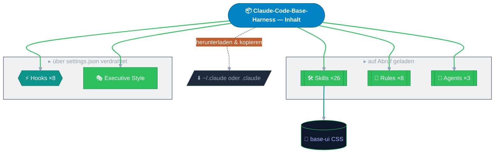

<a id="readme-top"></a>


<div align="center">

[English](README.md) | [Deutsch](README.de.md)


[](https://github.com/MaGe1993/Claude-Code-Base-Harness) [](https://github.com/MaGe1993/Claude-Code-Base-Harness/network/members) [](https://ko-fi.com/marius_gensler)


**Rules · Skills · Hooks — kopiere was du brauchst, anpassen und loslegen.**

[Fehler melden](https://github.com/MaGe1993/Claude-Code-Base-Harness/issues) · [Feature vorschlagen](https://github.com/MaGe1993/Claude-Code-Base-Harness/issues)

> [!NOTE]
> Die englische Version ist das Original. Diese Übersetzung kann hinter dem Original zurückliegen.

</div>



<div align="center">

[Was ist das?](#was-ist-das) · [Enthaltene Komponenten](#enthaltene-komponenten) · [Installation](#installation) · [Unterstützung](#unterstuetzung) · [Lizenz](#lizenz)

</div>

<a id="was-ist-das"></a>

<details open>
<summary><b><font size="5">🎯&nbsp; Was ist das?</font></b></summary>

Ein kuratiertes, meinungsstarkes Set an Claude-Code-Konfigurationsartefakten — Rules, Skills,
Agents, Hooks, Output Styles und ein Base UI — das jedem Projekt ein korrektes Claude-Code-Setup
gibt, ohne es von Grund auf zu schreiben. Kein Plugin, keine Installation: einfache Dateien, die
du nach `~/.claude/` (alle Projekte) oder in das `.claude/` eines Projekts kopierst und anpasst.

<p align="right">(<a href="#readme-top">nach oben</a>)</p>

</details>

<a id="enthaltene-komponenten"></a>

<details open>
<summary><b><font size="5">📦&nbsp; Enthaltene Komponenten</font></b></summary>

### 🛠️ Skills

| Skill | Funktion |
|---|---|
| `audit-legal` | EU-AI-Act- / DSGVO- / deutsches-Recht-Compliance-Triage |
| `audit-security` | OWASP Top 10:2025 Quellcode-Sicherheitsaudit |
| `echarts` | Apache ECharts 5 Charts in base-ui HTML |
| `explain` | Tiefenkalibrierte Erklärungen, einfach oder detailliert |
| `file-changelog` | CHANGELOG.md erstellen (Keep a Changelog 1.1.0) |
| `file-claude` | CLAUDE.md erstellen und auditieren; Auto-Memory migrieren |
| `file-license` | LICENSE und Third-Party-Attribution erstellen |
| `file-project` | PROJECT.md erstellen — die KI-seitige Architektur-Spezifikation |
| `file-readme` | README.md erstellen — relevanz-sortiert, visuell, GitHub-nativ |
| `frontend` | Standalone HTML über das base-ui Design-System |
| `hooks` | Lifecycle-Hooks mit Begleitskripten erstellen |
| `lean-review` | Read-only Qualitäts-Review beliebiger Artefakte |
| `loop` | Wiederkehrende Claude-Code-Loops einrichten und betreiben |
| `masterprompt` | Einen maximalen Experten-Masterprompt zu jedem Thema bauen |
| `mcp` | `.mcp.json` über alle Transporte erstellen und reparieren |
| `mermaid` | Gestylte, GitHub-renderbare Diagramme erzeugen |
| `new-project` | Ein neues Claude-Code-Projekt vollständig scaffolden |
| `outputstyle` | Output-Style-Dateien erstellen; liefert den Executive-Style |
| `proofread` | Pre-Ship-Verifikation eines fertigen Deliverables |
| `rules` | Rules erstellen; leitet an Hooks oder Settings weiter, wenn passend |
| `settings` | Berechtigungen, Modellauswahl und Env-Variablen konfigurieren |
| `skills` | Skills aus Bedarf oder Workflow erstellen und pflegen |
| `sota` | Gegroundete State-of-the-Art-Web-Recherche |
| `subagents` | Spezialisierte Subagenten-Definitionsdateien erstellen |
| `tasks` | Leitfaden zum Claude-Code-Task-System |
| `toon` | JSON oder YAML in token-effizientes TOON konvertieren |

### 📏 Rules

| Rule | Inhalt |
|---|---|
| `command-execution` _(immer aktiv)_ | Claude führt Befehle selbst aus; fordert nie dazu auf |
| `error-handling` | Keine stillen Catches, Fail-Fast, Backoff, strukturiertes Logging |
| `json-style` | JSON- und JSONC-Konventionen |
| `md-style` | Markdown-Konventionen für Harness-Dateien |
| `security` | Credential-Handling, Input-Validierung, Injection, Supply-Chain |
| `toon-style` | Token-effiziente tabellarische Daten für LLM-Prompts |
| `visual-verify` | UI-Ausgaben per Screenshot verifizieren; kein reiner Code-Review |
| `yaml-style` | YAML- und Frontmatter-Konventionen |

### ⚡ Hooks

Jeder Hook wird als `.ps1`- + `.sh`-Paar hinter einem `dispatch.mjs`-Launcher ausgeliefert —
Windows führt die `.ps1`, macOS/Linux die `.sh` aus, nichts manuell umzustellen.

| Hook | Ereignis | Funktion |
|---|---|---|
| `check-credentials` | PreToolUse | Blockiert Writes mit erkannten Keys, Tokens oder Secrets |
| `check-memory` | SessionStart | Erkennt Auto-Memory-Dateien, fordert Migration in CLAUDE.md |
| `cleanup-sessions` | SessionStart | Entfernt veraltete Session-Artefakte unter `~/.claude/` |
| `dangerous-cmd-guard` | PreToolUse | Blockiert katastrophale Shell-Befehle auf beiden Shells |
| `format-on-write` | PostToolUse | Formatiert geschriebene Dateien mit installierten Formatierern |
| `post-compact` | SessionStart | Injiziert PROJECT.md nach der Kompression neu in den Kontext |
| `pre-compact` | PreCompact | Blockiert Kompression nur, wenn PROJECT.md fehlt oder veraltet ist |
| `session-cost-logger` | Stop · PreCompact · SessionEnd | Loggt die Token-Nutzung pro Turn |

### 🤖 Agents

| Agent | Rolle |
|---|---|
| `ag-cqo` | Chief Quality Officer — Audit und Approved/Rejected-Stage-Gate |
| `ag-cso` | Chief Strategy Officer — Outward State-of-the-Art-Bewertung |
| `ag-cto` | Chief Technology Officer — schreibt, verifiziert und reviewt Code selbst |

### 🎭 Output Style

| Style | Modus |
|---|---|
| `Executive` | Bottom-line zuerst, knapp, entscheidungsbereit |

### 🎨 Base UI

| Asset | Was es ist |
|---|---|
| `base-ui` | Grün-Blau-Glassmorphism-CSS für KI-generiertes HTML, kein Build-Schritt |

<p align="right">(<a href="#readme-top">nach oben</a>)</p>

</details>

<a id="installation"></a>

<details open>
<summary><b><font size="5">📥&nbsp; Installation</font></b></summary>

### 🚀 Schnellstart — Terminal

Schnellster Weg — klonen und ins Projekt kopieren:

```bash
git clone https://github.com/MaGe1993/Claude-Code-Base-Harness.git
cp -r Claude-Code-Base-Harness/.claude Claude-Code-Base-Harness/CLAUDE.md dein-projekt/
```

Dann eine Claude-Code-Session im Projekt öffnen und fragen:

> Lies `CLAUDE.md` und `.claude/skills/skills.index.toon` und sag mir, was verfügbar ist.

> [!TIP]
> Passe `CLAUDE.md` an dein Projekt an — eigene Build-Befehle und Pfade eintragen, Nicht-Zutreffendes
> entfernen. Alles andere funktioniert wie kopiert.

### 🛠️ Manuelle Installation — kein Terminal

1. Auf der GitHub-Seite **Code → Download ZIP** klicken und entpacken.
2. Den Geltungsbereich wählen:
   - Nur ein Projekt → der Projekt-Root-Ordner.
   - Alle Projekte → `~/.claude/` (dein `.claude`-Ordner im Home-Verzeichnis).
3. Den entpackten **`.claude`**-Ordner und die **`CLAUDE.md`**-Datei mit dem Datei-Explorer in das Ziel kopieren.
4. Dort eine Claude-Code-Session öffnen und `CLAUDE.md` lesen lassen.

> [!IMPORTANT]
> Wenn im Ziel bereits eine `settings.json` existiert, den `hooks`-Block manuell zusammenführen —
> jedes Hook-Ereignis ist ein Array; anhängen statt die ganze Datei überschreiben.

<details open>
<summary>Teilinstallation — nur das Benötigte</summary>

Jedes Artefakt ist eigenständig. Einzelne Teile kopieren und danach `CLAUDE.md` so kürzen,
dass nur das Kopierte referenziert wird:

| Bedarf | Kopieren |
|---|---|
| Nur die Skills | `.claude/skills/` |
| Nur die Format-Rules | `.claude/rules/md-style.md`, `json-style.md`, `yaml-style.md` |
| Nur den Output Style | `.claude/output-styles/executive.md` + `outputStyle`-Key |
| Nur die Hooks | `.claude/hooks/` (inkl. `dispatch.mjs`) + `hooks`-Block |
| Nur das Base UI | `.claude/skills/frontend/assets/base-ui/` |

</details>

<details open>
<summary>Aktualisierung</summary>

Mit `git pull origin main` aktualisieren (oder das ZIP neu herunterladen). [CHANGELOG.md](CHANGELOG.md)
auf Breaking Changes prüfen, Skill- und Agent-Index in offenen Sessions neu einlesen und neue
`CLAUDE.md`-Routing-Zeilen oder `settings.json`-Hook-Registrierungen manuell zusammenführen — eigene
Anpassungen nicht überschreiben.

</details>

<p align="right">(<a href="#readme-top">nach oben</a>)</p>

</details>

<a id="unterstuetzung"></a>

<details open>
<summary><b><font size="5">💛&nbsp; Unterstützung</font></b></summary>

Wenn der Harness dir Zeit spart, hilft ein GitHub-Stern anderen, ihn zu finden.

[](https://github.com/MaGe1993/Claude-Code-Base-Harness)

Gefällt er dir? [Kauf mir einen Kaffee auf Ko-fi](https://ko-fi.com/marius_gensler) — das hält den Harness am Wachsen.

[](https://ko-fi.com/marius_gensler)

<p align="right">(<a href="#readme-top">nach oben</a>)</p>

</details>

<a id="lizenz"></a>

<details open>
<summary><b><font size="5">📄&nbsp; Lizenz</font></b></summary>

MIT — © 2026 Dr. Marius Gensler. Siehe [LICENSE](LICENSE).

<p align="right">(<a href="#readme-top">nach oben</a>)</p>

</details>


