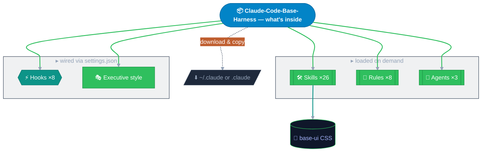

<a id="readme-top"></a>


<div align="center">

[English](README.md) | [Deutsch](README.de.md)


[](https://github.com/MaGe1993/Claude-Code-Base-Harness) [](https://github.com/MaGe1993/Claude-Code-Base-Harness/network/members) [](https://ko-fi.com/marius_gensler)


**Rules · Skills · Hooks — copy what you need, adapt and go.**

[Report Bug](https://github.com/MaGe1993/Claude-Code-Base-Harness/issues) · [Request Feature](https://github.com/MaGe1993/Claude-Code-Base-Harness/issues)

</div>



<div align="center">

[What is it?](#what-is-it) · [What you get](#what-you-get) · [Installation](#installation) · [Support](#support) · [License](#license)

</div>

<a id="what-is-it"></a>

<details open>
<summary><b><font size="5">🎯&nbsp; What is it?</font></b></summary>

A curated, opinionated set of Claude Code configuration artefacts — rules, skills, agents,
hooks, output styles, and a base UI — that gives any project a correct Claude Code setup
without authoring it from scratch. No plugin, no install: plain files you copy into
`~/.claude/` (all projects) or a project's `.claude/`, then adapt.

<p align="right">(<a href="#readme-top">back to top</a>)</p>

</details>

<a id="what-you-get"></a>

<details open>
<summary><b><font size="5">📦&nbsp; What you get</font></b></summary>

### 🛠️ Skills

| Skill | What it does |
|---|---|
| `audit-legal` | EU AI Act / GDPR / German-law compliance triage |
| `audit-security` | OWASP Top 10:2025 source-code security audit |
| `echarts` | Apache ECharts 5 charts in base-ui HTML |
| `explain` | Depth-calibrated explanations, simple or deep |
| `file-changelog` | Author CHANGELOG.md (Keep a Changelog 1.1.0) |
| `file-claude` | Author and audit CLAUDE.md; migrate auto-memory into it |
| `file-license` | Author LICENSE and third-party attribution |
| `file-project` | Author PROJECT.md — the AI-facing architecture spec |
| `file-readme` | Author README.md — relevance-ordered, visual, GitHub-native |
| `frontend` | Standalone HTML via the base-ui design system |
| `hooks` | Author lifecycle hooks with companion scripts |
| `lean-review` | Read-only quality review of any artifact |
| `loop` | Set up and run recurring Claude Code loops |
| `masterprompt` | Build a maximal expert masterprompt on any topic |
| `mcp` | Author and repair `.mcp.json` across all transports |
| `mermaid` | Generate styled, GitHub-renderable diagrams |
| `new-project` | Scaffold a new Claude Code project end to end |
| `outputstyle` | Author output style files; ships the Executive style |
| `proofread` | Pre-ship verification of a finished deliverable |
| `rules` | Author rules; routes to hooks or settings when those fit better |
| `settings` | Configure permissions, model selection, and env vars |
| `skills` | Author and maintain skills from a need or workflow |
| `sota` | Grounded state-of-the-art web research |
| `subagents` | Author specialist subagent definition files |
| `tasks` | Guide to the Claude Code task system |
| `toon` | Convert JSON or YAML to token-efficient TOON |

### 📏 Rules

| Rule | What it covers |
|---|---|
| `command-execution` _(always on)_ | Claude runs commands itself; never asks you to |
| `error-handling` | No silent catches, fail-fast, backoff, structured logging |
| `json-style` | JSON and JSONC conventions |
| `md-style` | Markdown conventions for harness files |
| `security` | Credential handling, input validation, injection, supply chain |
| `toon-style` | Token-efficient tabular data for LLM prompts |
| `visual-verify` | Screenshot-verify visual output; no code-only sign-off |
| `yaml-style` | YAML and frontmatter conventions |

### ⚡ Hooks

Each hook ships as a `.ps1` + `.sh` pair behind one `dispatch.mjs` launcher — Windows runs
the `.ps1`, macOS/Linux the `.sh`, nothing to swap by hand.

| Hook | Event | What it does |
|---|---|---|
| `check-credentials` | PreToolUse | Blocks writes containing detected keys, tokens, or secrets |
| `check-memory` | SessionStart | Detects auto-memory files, prompts migration into CLAUDE.md |
| `cleanup-sessions` | SessionStart | Prunes stale session artifacts under `~/.claude/` |
| `dangerous-cmd-guard` | PreToolUse | Blocks catastrophic shell commands on both shells |
| `format-on-write` | PostToolUse | Auto-formats written files with installed formatters |
| `post-compact` | SessionStart | Re-injects PROJECT.md into context after compaction |
| `pre-compact` | PreCompact | Blocks compaction only when PROJECT.md is missing or stale |
| `session-cost-logger` | Stop · PreCompact · SessionEnd | Logs token usage per turn |

### 🤖 Agents

| Agent | Role |
|---|---|
| `ag-cqo` | Chief Quality Officer — audit and Approved/Rejected stage-gate |
| `ag-cso` | Chief Strategy Officer — outward state-of-the-art assessment |
| `ag-cto` | Chief Technology Officer — writes, verifies, and self-reviews code |

### 🎭 Output style

| Style | Mode |
|---|---|
| `Executive` | Bottom-line first, terse, decision-ready |

### 🎨 Base UI

| Asset | What it is |
|---|---|
| `base-ui` | Green-blue glassmorphism CSS for AI-generated HTML, no build step |

<p align="right">(<a href="#readme-top">back to top</a>)</p>

</details>

<a id="installation"></a>

<details open>
<summary><b><font size="5">📥&nbsp; Installation</font></b></summary>

### 🚀 Quick start — terminal

Fastest path — clone and copy into your project:

```bash
git clone https://github.com/MaGe1993/Claude-Code-Base-Harness.git
cp -r Claude-Code-Base-Harness/.claude Claude-Code-Base-Harness/CLAUDE.md your-project/
```

Then open a Claude Code session in your project and ask:

> Read `CLAUDE.md` and `.claude/skills/skills.index.toon`, then tell me what's available.

> [!TIP]
> Adapt `CLAUDE.md` to your project — fill in your build commands and paths, remove what
> does not apply. Everything else works as copied.

### 🛠️ Manual install — no terminal

1. On the GitHub page, click **Code → Download ZIP** and extract it.
2. Choose the scope:
   - One project only → the project's root folder.
   - All your projects → `~/.claude/` (your home `.claude` folder).
3. Copy the extracted **`.claude`** folder and the **`CLAUDE.md`** file into the target with your file explorer.
4. Open a Claude Code session there and ask it to read `CLAUDE.md`.

> [!IMPORTANT]
> If a `settings.json` already exists in the target, merge the `hooks` block manually — each
> hook event is an array; append rather than overwrite the whole file.

<details open>
<summary>Partial install — take only what you need</summary>

Every artifact is standalone. Copy individual pieces, then trim `CLAUDE.md` to reference
only what you copied:

| Want | Copy |
|---|---|
| Just the skills | `.claude/skills/` |
| Just the format rules | `.claude/rules/md-style.md`, `json-style.md`, `yaml-style.md` |
| Just the output style | `.claude/output-styles/executive.md` + the `outputStyle` key |
| Just the hooks | `.claude/hooks/` (incl. `dispatch.mjs`) + the `hooks` block |
| Just the base UI | `.claude/skills/frontend/assets/base-ui/` |

</details>

<details open>
<summary>Updating</summary>

Pull with `git pull origin main` (or re-download the ZIP). Check [CHANGELOG.md](CHANGELOG.md)
for breaking changes, re-read the skill and agent index files in open sessions, and merge any
new `CLAUDE.md` routing rows or `settings.json` hook registrations manually — do not overwrite
your customizations.

</details>

<p align="right">(<a href="#readme-top">back to top</a>)</p>

</details>

<a id="support"></a>

<details open>
<summary><b><font size="5">💛&nbsp; Support</font></b></summary>

If this harness saves you time, a GitHub star helps others find it.

[](https://github.com/MaGe1993/Claude-Code-Base-Harness)

Enjoying it? [Buy me a coffee on Ko-fi](https://ko-fi.com/marius_gensler) — it keeps the harness growing.

[](https://ko-fi.com/marius_gensler)

<p align="right">(<a href="#readme-top">back to top</a>)</p>

</details>

<a id="license"></a>

<details open>
<summary><b><font size="5">📄&nbsp; License</font></b></summary>

MIT — © 2026 Dr. Marius Gensler. See [LICENSE](LICENSE).

<p align="right">(<a href="#readme-top">back to top</a>)</p>

</details>


